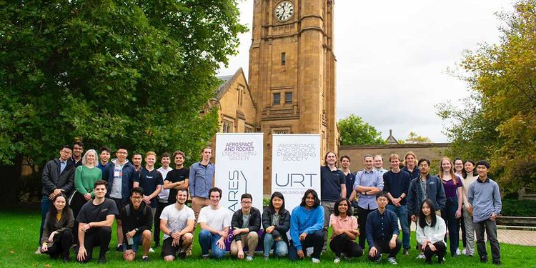

#### About ARES
ARES is the Aerospace & Rocket Engineering Society at the University of Melbourne. It represents the university in the rocketry and rover competitions. Additionally, ARES is offering capstone projects for interested engineering masters students in 2021.

Check out the [official website](https://eng.unimelb.edu.au/ares) to learn more about ARES. Follow us on [facebook](https://www.facebook.com/unimelbARES), [instagram](https://www.instagram.com/aresunimelb/) and [LinkedIn](https://www.linkedin.com/company/aerospace-rocket-engineering-society/) for upcoming events, career opportunities and other exciting things.

 

#### Project Phobos
The rocketry team, [Project Phobos](https://eng.unimelb.edu.au/ares/about/rocketry-team), is working on its inaugural rocket project and will represent the university into the [Australian Universities Rocketry Competition (AURC)](https://aurc.ayaa.com.au/).

 

#### Unimelb Rover Team
[The Unimelb Rover Team](https://eng.unimelb.edu.au/ares/about/rover-team) is currently working on its first rover, an entry into the [Australian Rover Challenge (ARC)](https://ecms.adelaide.edu.au/atcsr/australian-rover-challenge). Follow the rover team on [instagram](https://www.instagram.com/unimelbrover/) to learn more about their exciting journey.

 

#### Weekly Workshops
[The weekly workshops](https://github.com/ares-unimelb/ARES-Workshops-2021), delivered both online and in person, is designed to prepare a student with hands-on necessary skills for the rocketry and rover projects, as well as to provide the opportunity to learn about the aerospace industry.
